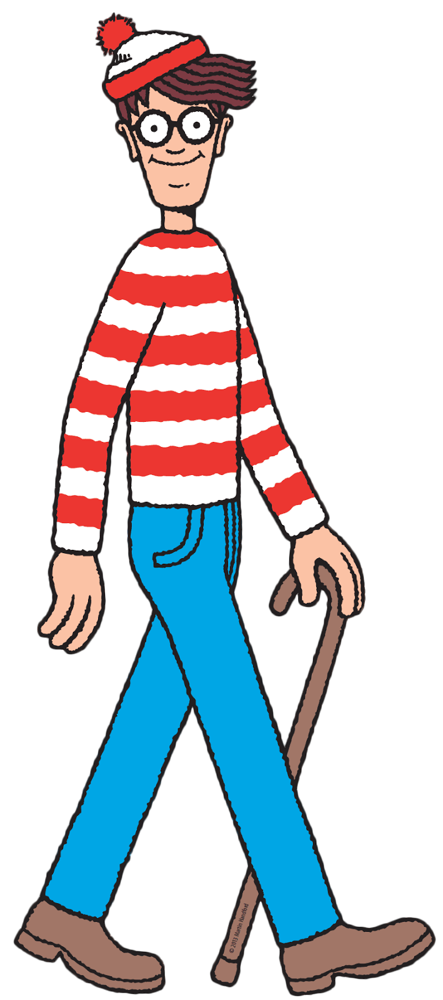
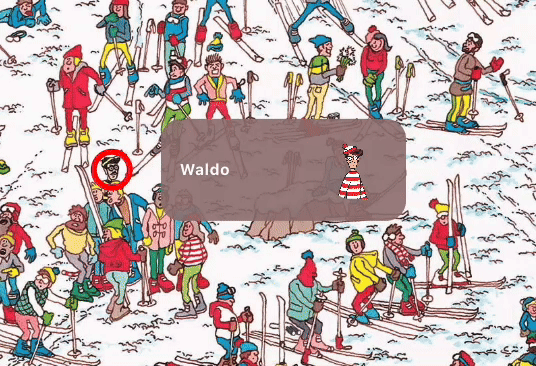
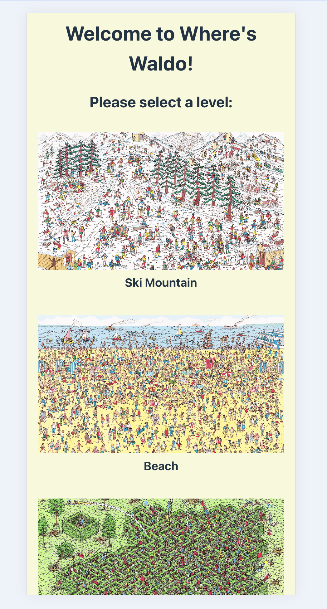

<div align="center">
  <a href="https://github.com/othneildrew/Best-README-Template">
  </a>
  <h1 align="center">Where's Waldo?</h1>

  <p align="center">
    <br />
    <a href="https://github.com/PhilipTimofeyev/wheres_waldo"><strong>Explore the docs »</strong></a>
    <br />
    <br />
    <a href="https://whereswaldo-philiptimofeyev.netlify.app/">View Demo</a>
    ·
    <a href="https://github.com/PhilipTimofeyev/wheres_waldo/issues/new?labels=bug&template=bug-report---.md">Report Bug</a>
    ·
    <a href="https://github.com/PhilipTimofeyev/wheres_waldo/issues/new?labels=enhancement&template=feature-request---.md">Request Feature</a>
  </p>

</div>


<!-- TABLE OF CONTENTS -->

<details>
  <summary>Table of Contents</summary>
  <ol>
    <li>
      <a href="#about-the-project">About The Project</a>
      <ul>
        <li><a href="#built-with">Built With</a></li>
      </ul>
    </li>
    <li><a href="#usage">Usage</a></li>
    <li><a href="#roadmap">Roadmap</a></li>
    <li><a href="#contributing">Contributing</a></li>
    <li><a href="#license">License</a></li>
    <li><a href="#contact">Contact</a></li>
    <li><a href="#acknowledgments">Acknowledgments</a></li>
  </ol>
</details>


<!-- ABOUT THE PROJECT -->

## About The Project


*Where's Waldo* is the penultimate project of The Odin Project curriculum. It is built using Ruby on Rails for the backend, and React with Vite for the frontend. 

The app is a digital version of the Martin Handford *Wheres Wally* books originally published in 1987, where the reader or user is presented with a picture of a scene, typically with a theme, where there is a dense arrangement of varying characters. The main character is the famous Waldo.



<p align="right">(<a href="#readme-top">back to top</a>)</p>

### Built With

[](https://skillicons.dev)


- Ruby on Rails
- React
- React Router
- Vite
- PostGreSQL
- Javascript
- AWS
- Heroku
- Netlify
- HTML/CSS

<p align="right">(<a href="#readme-top">back to top</a>)</p>

## Usage


#### Gameplay

Once a user selects a specific level, and timer on the Rails backend starts, with the goal of locating Waldo, and/or any other characters requested in the particular level, as quickly as possible. The time for finding Waldo is kept track of, and if the user's time is in the top five rank, the user's name and time is added to the top five rankings.

The level component contains three main parts:

1. The characters who need to be found

2. A clickable image where the user clicks to find and select a potential character
3. A timer which actively shows how much time has passed since the game has begun


<p align="right">(<a href="#readme-top">back to top</a>)</p>

When a user selects a point on the image, the point, which is a coordinate relative to the viewport, is converted to a "normalized" coordinate which correctly matches the intended selection of the image. 

Because each character has a specific location on an image, and different screens having differing coordinates, both the user selection and character location must be normalized. Once normalized, the user selected point is expanded into a a larger area to allow a permitted X/Y range. This permissible square can be adjusted using the `SQUARE_SIZE` constant in the `Level` component.

If the selection is incorrect, the character option shakes to let the user know the selection is not right.




Once all of the characters have been found, they are marked with green circles, their character image is marked green, and a modal with the top scores pops up.


If the user's score is in the top 5, they can add their name to the top scores list which shows their position, name and time. The added name sends an API post request to the backend to update the user's name, and renders the component with the name in realtime. Users who choose to not add their name, are simple added as *Anonymous*.

To prevent any foul play, the timer and score is created and checked on the Rails backend, instead of the React frontend. This helps prevent users from modifying the frontend code to give themselves higher scores.

This webapp was built with responsive design in mind, and all features are expected to work on desktop and mobile:




#### Adding Levels

The process of adding a level and characters is relatively simple. To do so, on the Rails backend, a new `Picture` must be added with an associated image. 

A `Picture` has five important attributes:

- A `title`: ie. *Ski Mountain*
- An `alt`: ie. *Winter Slopes*
- An image blob which is added through active storage and stored using AWS
- `image_height`
- `image_width`

Here is how the DB seed looks for the Ski Mountain level:

```ruby
beach_level = Picture.create(
    title: "Beach",
    alt: "A Day At The Beach",
    image_width: 3000,
    image_height: 1926
)
```

To attach the corresponding level image, the following is run:

`ski_mountain_level.image.attach(io: File.open("#{Rails.root}/app/assets/images/ski-mountain/ski-mountain.jpg"), filename: 'ski-mountain.jpg', content_type: 'image/jpg')`

Once this object is created and added to the database, a level is technically created and available to see on the React frontend.

The next thing to do is to add Waldo and/or any other characters to that level. 

A character is composed of four main attributes:

- A `name` ie. *Waldo*
- `x_coord`
- `y_coord`
- An image blob

Here is how the DB seed looks for the Waldo character in the Ski Mountain level:

`ski_waldo = ski_mountain_level.characters.create(name: "Waldo", x_coord: 2564, y_coord: 1380)`

Then the image must be added and associated with that Character:

`ski_waldo.image.attach(io: File.open("#{Rails.root}/app/assets/images/waldo-main.png"), filename: 'waldo-main.png', content_type: 'image/png')`

Once the `Picture` and `Character` objects have been created and associated, that level will be available on the frontend for a User to play. The coordinates will be normalized and the score model will be associated with whichever level is selected automatically.

Although this makes the process relatively easy, it could be simplified by adding an admin panel with a form that adds these attributes using the frontend, instead of having to do it in the console on the Rails backend.

 <!-- ROADMAP -->

## Future Features

- Creating a frontend page that allows users to upload and add their own levels/characters to make the webapp more community driven
- Making "dynamic levels" where the characters to find are created at random, allowing an endless amount of gameplay since each round will be new and unpredictable.


See the [open issues](https://github.com/PhilipTimofeyev/wheres_waldo/issues) for a full list of proposed features (and known issues).

<p align="right">(<a href="#readme-top">back to top</a>)</p>

<!-- CONTRIBUTING -->

## Contributing

Contributions are what make the open source community such an amazing place to learn, inspire, and create. Any contributions you make are **greatly appreciated**.

If you have a suggestion that would make this better, please fork the repo and create a pull request. You can also simply open an issue with the tag "enhancement".
Don't forget to give the project a star! Thanks again!

1. Fork the Project
2. Create your Feature Branch (`git checkout -b feature/AmazingFeature`)
3. Commit your Changes (`git commit -m 'Add some AmazingFeature'`)
4. Push to the Branch (`git push origin feature/AmazingFeature`)
5. Open a Pull Request

<!-- LICENSE -->

## License

Distributed under the MIT License. See `LICENSE.txt` for more information.

<p align="right">(<a href="#readme-top">back to top</a>)</p>

<!-- CONTACT -->

## Contact

Philip Timofeyev -  philiptimofeyev@gmail.com

Project Link: [https://github.com/PhilipTimofeyev/wheres_waldo](https://github.com/PhilipTimofeyev/wheres_waldo)

<p align="right">(<a href="#readme-top">back to top</a>)</p>


<!-- ACKNOWLEDGMENTS -->
## Acknowledgments

Use this space to list resources you find helpful and would like to give credit to. I've included a few of my favorites to kick things off!

* Martin Handford, the creator of *Where's Wally?*
* [Waldo Wallpapers](https://www.wallpaperflare.com/waldo-cartoon-where-s-wally-multi-colored-abundance-large-group-of-objects-wallpaper-pckap)
* [README Template](https://github.com/banesullivan/README)
* [Skill Icons](https://github.com/tandpfun/skill-icons?tab=readme-ov-file#example)

<p align="right">(<a href="#readme-top">back to top</a>)</p>
